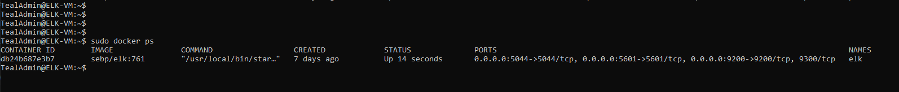

## Automated ELK Stack Deployment

The files in this repository were used to configure the network depicted below.

These files have been tested and used to generate a live ELK deployment on Azure. They can be used to either recreate the entire deployment pictured above. Alternatively, select portions of the playbook file may be used to install only certain pieces of it, such as Filebeat.

  - install_elk.yml
  - filebeat-playbook.yml
  - metricbeat-playbook.yml

This document contains the following details:
- Description of the Topologu
- Access Policies
- ELK Configuration
  - Beats in Use
  - Machines Being Monitored
- How to Use the Ansible Build

### Description of the Topology

The main purpose of this network is to expose a load-balanced and monitored instance of DVWA, the D*mn Vulnerable Web Application.

Load balancing ensures that the application will be highly available, in addition to restricting inbound access to the network.
- Load balancers make it so that both webservers are equally sharing the incoming traffic. The advatage of a jump box is that it acts as a central access point.

Integrating an ELK server allows users to easily monitor the vulnerable VMs for changes to the file systems of the VMs on the network and system metrics.
- Filebeat watch for logs and files.
- Metricbeat record metrics and statistics.

The configuration details of each machine may be found below.
_Note: Use the [Markdown Table Generator](http://www.tablesgenerator.com/markdown_tables) to add/remove values from the table_.

| Name     | Function   | IP Address | Operating System |
|----------|------------|------------|------------------|
| Jump Box | Gateway    | 10.0.0.4   | Linux            |
| Web-1    | Web Server | 10.0.0.7   | Linux            |
| Web-2    | Web Server | 10.0.0.8   | Linux            |
| ELK-VM   | Monitoring | 10.1.0.4   | Linux            |

### Access Policies

The machines on the internal network are not exposed to the public Internet. 

Only the jump box machine can accept connections from the Internet. Access to this machine is only allowed from the following IP addresses:
- Jump Box '13.66.161.189'

Machines within the network can only be accessed by each other.
- Access to the ELK VM was only allowed from the Jump Box whose IP address is 13.66.161.189.

A summary of the access policies in place can be found in the table below.

| Name     | Publicly Available | Allowed IP Addresses |
|----------|--------------------|----------------------|
| Jump Box | Yes                | 13.66.161.189        |
| Web-1    | No                 | 10.0.0.1-254         |
| Web-2    | No                 | 10.0.0.1-254         |
| ELK-VM   | No                 | 10.1.0.1-254         |

### Elk Configuration

Ansible was used to automate configuration of the ELK machine. No configuration was performed manually, which is advantageous because...
- To automate tedious tasks

The playbook implements the following tasks:
- Install Docker
- Install python3-pip
- Install Docker Module
- Increase Virtual Memory and use more memory
- Download and Launch a Docker ELK Container

The following screenshot displays the result of running `docker ps` after successfully configuring the ELK instance.

### Target Machines & Beats
This ELK server is configured to monitor the following machines:
- Web-1 '10.0.0.7' and Web-2 '10.0.0.8'

We have installed the following Beats on these machines:
- Filebeat
- Metricbeat

These Beats allow us to collect the following information from each machine:
- Filebeat collects information on files and logs
- Metricbeat collects information on metrics and statistics

### Using the Playbook
In order to use the playbook, you will need to have an Ansible control node already configured. Assuming you have such a control node provisioned: 

SSH into the control node and follow the steps below:
- Copy the playbook file to Ansible Control Node.
- Update the playbook file to indicate which machine to perform the playbook on by specify hosts:...
- Run the playbook, and navigate to https://[YourELKExternalIP]:5601 to check that the installation worked as expected.
